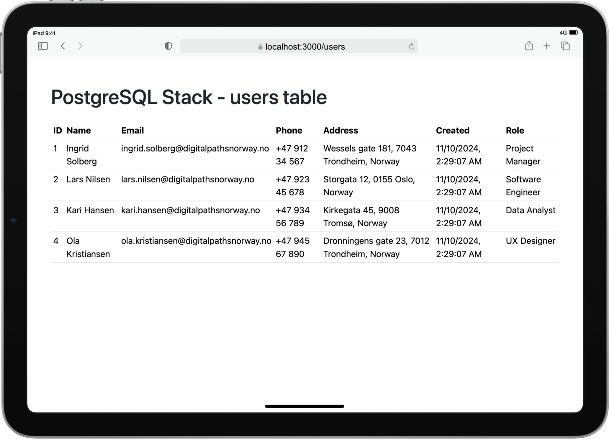

# Web Stack Project

A basic framework for Node.js and PostgreSQL applications, designed to be Dockerized and deployed across platforms. This setup includes a minimal Express server, PostgreSQL integration, and Bootstrap for basic styling. Ideal for quickly
bootstrapping new projects.

> **Note**: All data, including the company names, addresses, and other details, are fictional.
> Nordic-themed data is used to make the sample content stand out from "real" data in an Australasian context.

## Tech Stack

- **Node.js** - JavaScript runtime
- **Express** - Web application framework for Node.js
- **PostgreSQL** - Relational database
- **Docker** - Containerisation for deployment and local development
- **pgAdmin** - PostgreSQL management interface (optional)
- **Bootstrap** - Frontend styling and responsive design



## Project Structure

```plaintext
my-express-app/
├── public/                    # Static assets (CSS, JS, images)
├── src/                       # Main application source files
│   ├── controllers/           # Route controllers
│   ├── models/                # Database models
│   ├── routes/                # Route definitions
│   ├── views/                 # Templating engine views
│   ├── config/                # Config files (database setup, etc.)
│   ├── app.js                 # Main app configuration
│   └── server.js              # Server start and setup
├── .env                       # Environment variables
├── Dockerfile                 # Dockerfile for containerizing the app
├── docker-compose.yml         # Docker Compose configuration
├── init.sql                   # SQL for initializing the database
├── package.json               # Project dependencies
└── README.md                  # Project documentation
```

## Features

- Preconfigured Express server with PostgreSQL connection using `pg`
- Bootstrap styling included for quick UI setup
- Dockerized environment for streamlined deployment and local development
- Example route (`/users`) displaying user data in a Bootstrap-styled table

## Getting Started

### Prerequisites

- [Node.js](https://nodejs.org/)
- [Docker](https://www.docker.com/)
- [pgAdmin](https://www.pgadmin.org/) (optional for database management)

### Installation

1. **Clone the repository**:
   ```bash
   git clone https://github.com/steven2k2/web_stack.git
   cd web_stack
   ```

2. **Install dependencies**:
   ```bash
   npm install
   ```

3. **Environment setup**:
    - Copy `.env.example` to `.env` and update values as needed.

4. **Run with Docker**:
   ```bash
   docker-compose up
   ```

5. **Access the Application**:
    - **Express server**: [http://localhost:3000](http://localhost:3000)
    - **pgAdmin** (if configured): [http://localhost:pgAdmin_port](http://localhost:pgAdmin_port)

## Development

### Starting the Server

```bash
npm start
```

### Development Mode

If using `nodemon`:

```bash
npm run dev
```

## Example Endpoints

- **GET /users** - Displays users in a styled table format using Bootstrap.

## Deployment

1. Ensure Docker is installed on your server or deployment environment.
2. Run the following to start the application:

   ```bash
   docker-compose up -d
   ```
